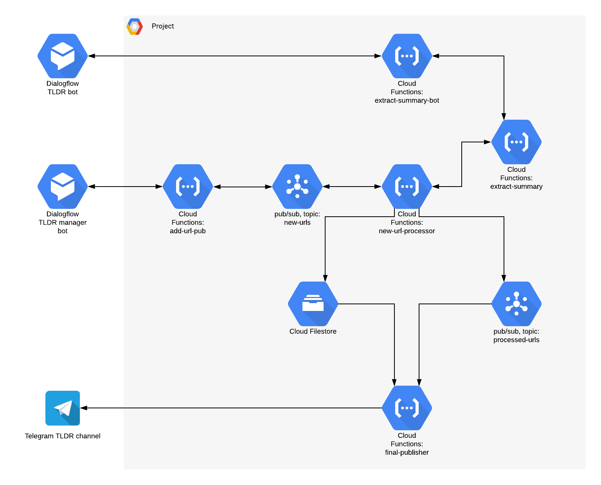

# TLDR

This is a very-very simple Telegram based bot that generates TL;DR from an article (URL). Since the majority of news articles now days are just 3-4 facts I do want to read them instead of a full article:)

* [TL;DR Telegram channel](https://t.me/techtldr)
* [TL;DR bot](https://t.me/tldrMeBot)

# Architecture

